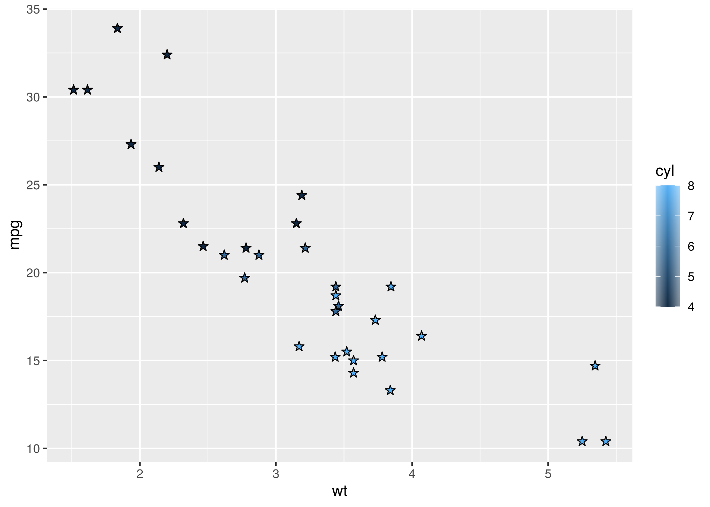

<!-- README.md is generated from README.Rmd. Please edit that file -->

# ggstar: star layer for ggplot2

[](https://cran.r-project.org/package=ggstar)
<!-- r badge_devel("xiangpin/ggstar", "green") -->
[](https://cran.r-project.org/package=ggstar)
[](https://cranlogs.r-pkg.org/downloads/total/last-month/ggstar)
[](https://cranlogs.r-pkg.org/downloads/total/last-week/ggstar)

To create the regular polygon layer for easily discernible shapes, we
developed the package, it can be easily used if you know the ‘ggplot2’.

# :writing\_hand: Author

[Shuangbin Xu](https://github.com/xiangpin)

School of Basic Medical Sciences, Southern Medical University

# :arrow\_double\_down: Installation

Get the released version from `CRAN`:

``` r
install.packages("ggstar")
```

Or the development version from `github`:

``` r
if (!requireNamespace("devtools", quietly=TRUE))
    install.packages("devtools")
devtools::install_github("xiangpin/ggstar")
```

# :beginner: Usage

Total starshapes:


``` r
library(ggplot2)
library(ggstar)
p <- ggplot(data=mtcars, 
            mapping=aes(x=wt, 
                        y=mpg, 
                        fill=cyl)) + 
     geom_star()
p
```



``` r
p2 <- ggplot(data=iris, 
             mapping=aes(x=Sepal.Length, 
                         y=Sepal.Width, 
                         fill=Species)) +
     geom_star()
p2
```


``` r
p3 <- ggplot(data=iris,
             mapping=aes(x=Sepal.Length,
                         y=Sepal.Width,
                         fill=Species,
                         starshape=Species)) +
      geom_star() + scale_starshape_manual(values=c(1, 2, 9))
p3
```


# :book: Vignette

For more details, please refer to the [online
vignette](https://cran.r-project.org/web/packages/ggstar/vignettes/ggstar.html)

If you have installed it, you can also view the vignette on local.

``` r
browseVignettes("ggstar")
```

# :sparkling\_heart: Contributing

We welcome any contributions\! By participating in this project you
agree to bide by the terms outlined in the [Contributor Code of
Conduct](CONDUCT.md).
