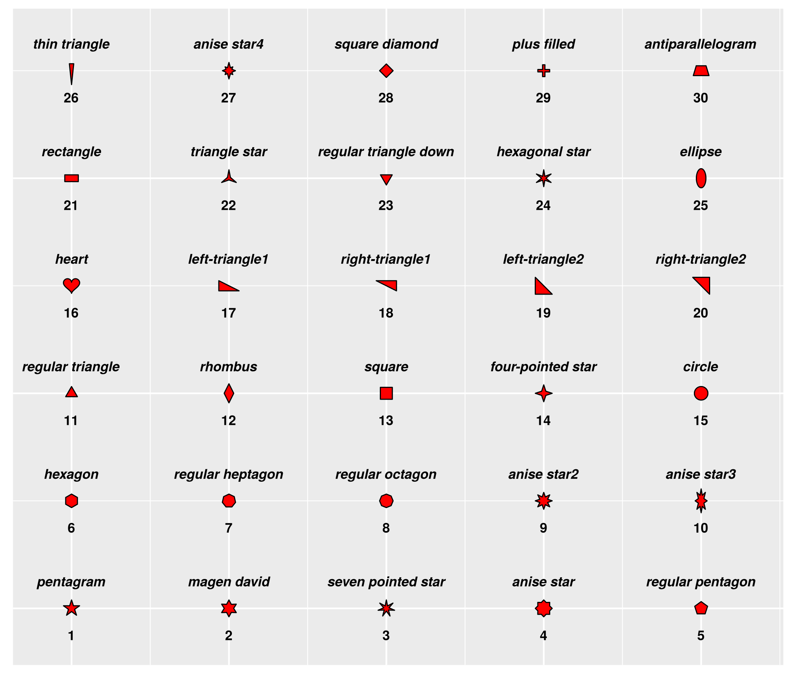
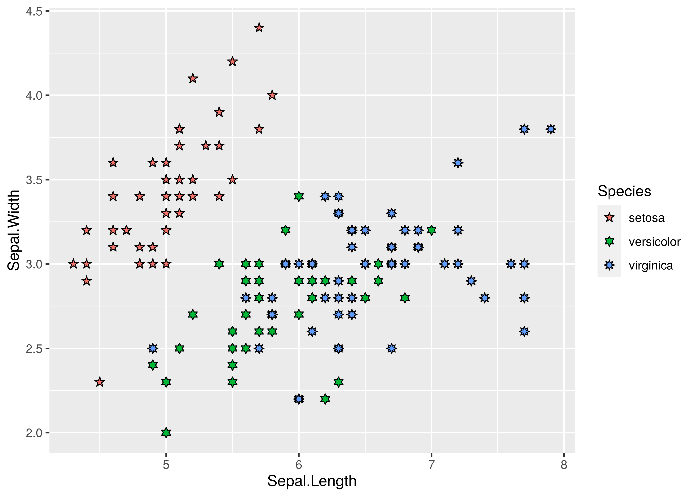

<!-- README.md is generated from README.Rmd. Please edit that file -->

# ggstar: star layer for ggplot2

ggstar is designed to create the siogon layer to easily discernible
shapes for ggplot2.

# :writing\_hand: Author

[Shuangbin Xu](https://github.com/xiangpin)

School of Basic Medical Sciences, Southern Medical University

# :arrow\_double\_down: Installation

``` r
if (!requireNamespace("devtools", quietly=TRUE))
    install.packages("devtools")
devtools::install_github("xiangpin/ggstar")
```

# :beginner: Usage

Total starshapes:



``` r
library(ggplot2)
library(ggstar)
p <- ggplot(data=mtcars, 
            mapping=aes(x=wt, 
                        y=mpg, 
                        fill=cyl)) + 
     geom_star()
p
```


``` r
p2 <- ggplot(data=iris, 
             mapping=aes(x=Sepal.Length, 
                         y=Sepal.Width, 
                         fill=Species)) +
     geom_star()
p2
```


``` r
p3 <- ggplot(data=iris,
             mapping=aes(x=Sepal.Length,
                         y=Sepal.Width,
                         fill=Species,
                         starshape=Species)) +
      geom_star() + scale_starshape_manual(values=c(1, 2, 9))
p3
```



## :sparkling\_heart: Contributing

We welcome any contributions\! By participating in this project you
agree to bide by the terms outlined in the [Contributor Code of
Conduct](CONDUCT.md).
